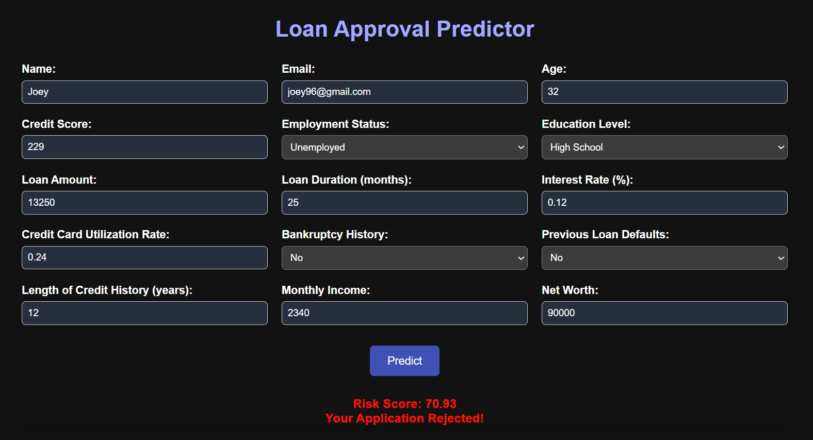

# 🏦 Risk Assessment & Loan Approval Prediction

A Flask-based web app that predicts **Risk Score (regression)** and **Loan Approval (classification)** based on financial and personal data.



---

## 📌 Overview

This project uses machine learning models trained on a synthetic dataset to:

- Predict a **Risk Score** for applicants (LGBM Regressor)
- Predict whether a **Loan will be approved** (Random Forest Classifier)

The app provides a user-friendly web interface built using Flask for real-time predictions.

---

## 📁 Project Structure

```

Loan-Approval-Predictor/
│
├── models/               # All saved pickle files
│   ├── clf_model.pkl
│   ├── reg_model.pkl
│   └── scaler.pkl

├── static/
│   └── style.css
│
├── templates/
│   └── index.html
│
├── app.py                # Flask backend
├── .gitignore
├── requirements.txt
├── Loan.csv              # Dataset
├── EDA.ipynb             # Full analysis and experimentation
└── model.ipynb           # Final selected models for deployment

````


## 🔧 Data & Modeling

All preprocessing, feature engineering, and model testing are documented in **`EDA.ipynb`**. The final selected models are saved and used in **`final_model.ipynb`** and the deployed Flask app.

---

## 🚀 Deployment

The app uses Flask to serve a web interface:

- `index.html` for frontend input
- `app.py` for handling predictions
- Models loaded from the `models/` directory
- CSS styling in `static/style.css`

---

## 🧠 Results Summary

- **Risk Score Prediction**: LGBMRegressor (scaled features) gave the best performance.
- **Loan Approval Prediction**: RandomForestClassifier showed highest accuracy and consistency.

---

## 💻 How to Use This Project

### 1. Clone the Repository

```bash
git clone https://github.com/your-username/loan-approval-predictor.git
cd loan-approval-predictor
````

### 2. Create a Virtual Environment

```bash
python -m venv venv
# On Windows:
venv\Scripts\activate
# On macOS/Linux:
source venv/bin/activate
```

### 3. Install Dependencies

```bash
pip install -r requirements.txt
```

### 4. Run the App

```bash
python app.py
```

Then open your browser and go to:
📍 `http://127.0.0.1:5000`

---

## Acknowledgments

Special thanks to [@SHAHMACP](https://github.com/SHAHMACP) for the guidance and support throughout this project. 🙌

---
