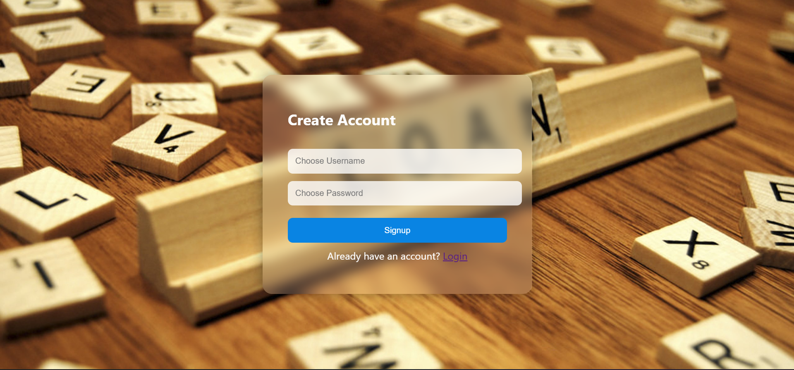
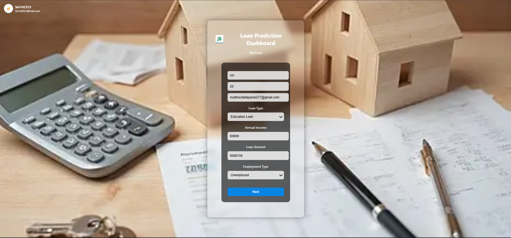
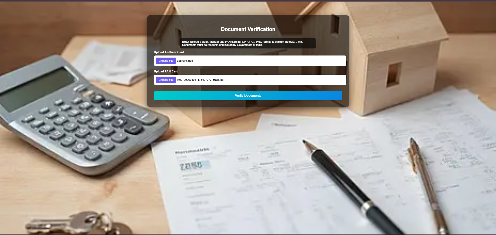
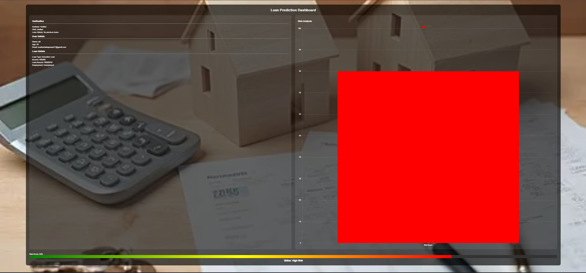

# 🏦 Loan Approval Predictor (ML + Flask + Authentication)

A machine-learning-based Loan Approval System with **user authentication**,  
**Risk Score prediction**, and an **interactive dashboard** built using Flask.

---

## 📌 Overview

--A Flask-based Loan Approval Prediction System that uses Machine Learning to predict loan risk and approval status. The application includes secure user authentication, document verification (Aadhaar & PAN), OCR-based PAN validation, and a risk assessment dashboard.

--The system validates Aadhaar and PAN documents before generating loan risk predictions and approval status.

---

## 🔐 User Authentication (NEW)

A complete authentication system is added:

- **Login page**
- **Signup page**
- **Session-based login**
- **Protected dashboard (index.html)**
- **Users stored securely using SQLite and SQLAlchemy**

Only logged-in users can access:
- Prediction Form  
- Dashboard  
- Results  

## Features

- User Registration and Login
- Forgot Password and Reset Password
- Loan Application Dashboard
- Education Loan Fee Structure Validation
- Aadhaar Verification
- PAN Card Verification using Tesseract OCR
- Loan Risk Score Prediction
- Loan Approval/Rejection Prediction
- User Session Management
- Previous Prediction History
- Responsive UI using HTML, CSS, and Bootstrap

---

## Tech Stack

### Frontend
- HTML
- CSS
- Bootstrap

### Backend
- Flask
- Python

### Database
- SQLite
- SQLAlchemy

### Machine Learning
- Scikit-Learn
- Pandas
- NumPy

### OCR & Image Processing
- Tesseract OCR
- Pillow (PIL)
- pdf2image

---

### 🔑 Authentication Screenshots


### Login Page


### Signup Page


### Dashboard


### Verification Page


### Result Page

---

## 📁 Project Structure

```
Loan-Approval-Predictor/
│
├── models/
│   ├── clf_model.pkl
│   ├── reg_model.pkl
│   └── scaler.pkl
│
├── static/
│   ├── style.css
│   ├── bg.jpg
│   ├── dashboard_bg.jpg
│   ├── profile.png
│   ├── loan-logo.png
│   └── screenshots/
│       ├── login.png
│       ├── signup.png
│       ├── dashboard.png
│       ├── verify.png
│       └── result.png
│
├── templates/
│   ├── login.html
│   ├── register.html
│   ├── forgot.html
│   ├── reset.html
│   ├── index.html
│   ├── verify.html
│   └── result.html
│
├── app.py
├── requirements.txt
├── Loan.csv
├── EDA.ipynb
├── model.ipynb
├── .gitignore
└── README.md
````

## 🔧 Data & Modeling

All preprocessing, feature engineering, and model experimentation are documented in:

- **EDA.ipynb** → Cleaning, visualization, correlation, feature engineering  
- **model.ipynb** → Model training & evaluation

### ✔ Final ML Pipeline

- Features standardized and numeric columns log-transformed (`log1p`)
- **LGBM Regressor** → Predicts Risk Score
- **Random Forest Classifier** → Predicts Loan Approval based on Risk Score
- Saved models:
  - `reg_model.pkl`
  - `clf_model.pkl`
  - `scaler.pkl`

---

## 🚀 Deployment

The Flask application provides:

### 📂 **Templates**
- **index.html** → Input form, progress bar, visual dashboard  
- **result.html** → Shows score, approval result, pie charts  
- **login.html** → Login UI  
- **signup.html** → Signup UI  

### 📁 **Backend**
- **app.py**
  - Routes for login, signup, prediction
  - Session authentication
  - Returns history + chart data as JSON

### 🎨 **Static**
- **style.css**  
- **login.png, signup.png, dashboard.png** (screenshots)

---

## 🧠 Results Summary

- **Risk Score Prediction:** LGBM Regressor with standardized features  
- **Loan Approval Prediction:** Random Forest Classifier  
- **Dashboard:** Progress bar, history table, pie charts  
- **Authenticated Access:** Only logged-in users can use the tool

---

## 💻 Future Improvements

- Save prediction history in a database.
- Add more visual analytics for loan trends.
- Deploy on Heroku or AWS for live access.
- Implement email-based OTP verification. 

---

## 💻 How to Use This Project

### 1. Clone the Repository

```bash
git clone https://github.com/siri142523/Loan---Predictor.git
cd loan-approval-predictor
````

### 2. Create a Virtual Environment

```bash
python -m venv venv
# On Windows:
venv\Scripts\activate
# On macOS/Linux:
source venv/bin/activate
```

### 3. Install Dependencies

```bash
pip install -r requirements.txt
```

### Install Tesseract OCR

Download and install Tesseract OCR.

Update the path in `app.py`:

```python
pytesseract.pytesseract.tesseract_cmd = \
r"C:\Program Files\Tesseract-OCR\tesseract.exe"
```

### 4. Run the App

```bash
python app.py
```

Then open your browser and go to:
📍 `http://127.0.0.1:5000`

---

## 👩‍💻 Author

**T. Siri Chandana**

- B.Tech CSE Student
- GitHub: https://github.com/siri142523